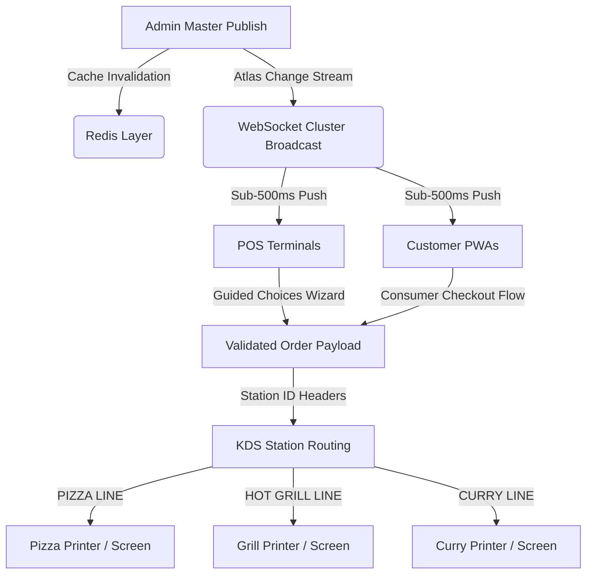

# Elevating TakeawayPOS Pro: Enterprise Architecture & Process Flow Proposals

This report synthesizes the core principles of the **Food Order Process Flow** (`deep-research-report.md`) and the concrete structures of the **Enterprise Menu Architecture** (`docx`) to suggest how these paradigms elevate the application into an enterprise-grade POS platform.

---

## Technical Elevation Matrix

By unifying the master-configuration pipeline with guided choices and KDS print routing, the system shifts from a simple MVP to a robust, fault-tolerant commercial hospitality platform:

---

## 1. Unified Schema & Normalization (Zero Price Divergence)
*   **The Problem**: Traditional systems list variations (e.g. Small Curry, Large Curry) as separate flat items. This makes sales analysis, stock tracking, and group customizer maintenance fragmented.
*   **The Elevation**: By implementing a **Category ➔ Base Item ➔ Variation ➔ Modifier Group ➔ Option** hierarchy, we model items uniformly. A Garlic Naan exists once as a base item, but is projected as:
    1.  A standalone side item in the *Sides & Breads* category.
    2.  A side accompaniment inside the *Curries Accompaniment Group* upcharge.
    3.  A component selection inside the *Family Curry Night Deal* bundle.
*   **Operational Benefit**: Single source of truth. Modifying Naan price in the Admin panel updates all three surfaces instantly, preventing menu billing discrepancies.

---

## 2. Guided Sequential Choice Wizard (Zero-Error Checkout)
*   **The Problem**: Staff under rush hours often forget to ask for required choices (e.g. spice level for curries, bun style for burgers) or miscalculate topping surcharges manually.
*   **The Elevation**: The customizer modal forces cashiers through a tabbed sequence:
    $$\text{Size / Portion} \longrightarrow \text{Required Build (Crust/Bun)} \longrightarrow \text{Base Sauce} \longrightarrow \text{Add-Ons (Toppings)}$$
*   **Operational Benefit**:
    *   **Required blocks**: POS blocks order submission until mandatory selections are completed.
    *   **Enforced limits**: Automatically applies Pizza rules (first 5 vegetables free, +£0.80 surcharge beyond 5; premium toppings +£1.00 each from the first item) and Burger rules (Min 1, Max 2 sauces free).

---

## 3. Composite Combo & Bundle Modeling (Smart Inventory/VAT)
*   **The Problem**: Standard POS packages bundles as a single item with text notes. This obscures KDS routing, hides tax percentages (e.g. soft drink standard rate VAT vs zero-rated food), and prevents individual item customizability.
*   **The Elevation**: Model combos as dynamic parent-child bundles (e.g., Burger Meal Deal £10.99) where each slot is linked to allowed category queries.
*   **Operational Benefit**:
    *   **Sub-modifier cascading**: Cashiers can configure the burger inside the combo (e.g., Double Patty, Gluten-Free Bun +£1.00) while inheriting base deal pricing.
    *   **VAT compliance**: Breaks down itemized standard/reduced tax rates inside composite lines.

---

## 4. Isolated Kitchen Ticket & KDS Routing
*   **The Problem**: General receipts contain all items, forcing chefs to read through unrelated tickets (e.g., grill chefs looking past curry items).
*   **The Elevation**: Leverage the `kitchenStationId` on `MenuItem` categories to split order payloads during validation.
*   **Operational Benefit**:
    *   Generates isolated kitchen ticket formats containing only relevant lines and nested modification labels (e.g., `1x CHICKEN BURGER -> Double Patty, Mild Cheddar, NOTE: No gherkins`).
    *   Dispatches station streams directly to physical printers or Socket.io rooms on the KDS.

---

## 5. Event-Driven Real-Time Sync Topology
*   **The Problem**: Changes to menu items or stock outages require manually restarting terminal applications or forcing browser page reloads.
*   **The Elevation**: Implement Atlas Change Stream Listeners coupled with Redis invalidation hooks.
*   **Operational Benefit**:
    *   Toggling "Sold Out" on an ingredient deactivates the option on the website and POS within 500ms.
    *   Prevents customers from ordering unavailable items, reducing refund overheads.
